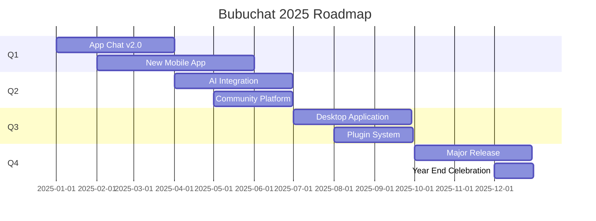

<div align="center">


[](https://git.io/typing-svg)

<p align="center">
  
  
  
</p>

<p align="center">
  <a href="https://github.com/orgs/bubuchat/repositories">
    
  </a>
  <a href="https://discord.gg/bubuchat">
    
  </a>
  <a href="https://github.com/bubuchat">
    
  </a>
</p>

</div>

---

## 🎯 WHO WE ARE

<div align="center">

```ascii
╔══════════════════════════════════════════════════════════════════╗
║                                                                  ║
║   ██████╗ ██╗   ██╗██████╗ ██╗   ██╗ ██████╗██╗  ██╗ █████╗ ████████╗   ║
║   ██╔══██╗██║   ██║██╔══██╗██║   ██║██╔════╝██║  ██║██╔══██╗╚══██╔══╝   ║
║   ██████╔╝██║   ██║██████╔╝██║   ██║██║     ███████║███████║   ██║      ║
║   ██╔══██╗██║   ██║██╔══██╗██║   ██║██║     ██╔══██║██╔══██║   ██║      ║
║   ██████╔╝╚██████╔╝██████╔╝╚██████╔╝╚██████╗██║  ██║██║  ██║   ██║      ║
║   ╚═════╝  ╚═════╝ ╚═════╝  ╚═════╝  ╚═════╝╚═╝  ╚═╝╚═╝  ╚═╝   ╚═╝      ║
║                                                                  ║
╚══════════════════════════════════════════════════════════════════╝
```

</div>

We're **Bubuchat** – a collective of three passionate developers who believe the best code is written together. We don't just build projects; we **challenge each other**, **learn relentlessly**, and **push boundaries** while having a blast doing it.

<div align="center">

```
┌─────────────────────────────────────────────────────────────┐
│  🎮 CODE  →  📚 LEARN  →  💪 CHALLENGE  →  🔄 REPEAT       │
└─────────────────────────────────────────────────────────────┘
```

</div>

### 📱 Stay Updated

<table>
<tr>
<td align="center" width="25%">
  
  <br><b>GitHub</b>
  <br><sub>Follow our repositories</sub>
  <br><a href="https://github.com/bubuchat">@bubuchat</a>
</td>
<td align="center" width="25%">
  
  <br><b>Discord</b>
  <br><sub>Join our community</sub>
  <br><a href="https://discord.gg/bubuchat">Chat with us</a>
</td>
<td align="center" width="25%">
  
  <br><b>Twitter</b>
  <br><sub>Latest updates</sub>
  <br><a href="https://twitter.com/bubuchat">@bubuchat</a>
</td>
<td align="center" width="25%">
  
  <br><b>Email</b>
  <br><sub>Business inquiries</sub>
  <br><a href="mailto:contact@bubuchat.dev">contact@bubuchat.dev</a>
</td>
</tr>
</table>

</div>

---

## 📜 SPONSORS & SUPPORTERS

<div align="center">

```
╔══════════════════════════════════════════════════════════════════╗
║     Want to support our work? Become a sponsor! 💝              ║
╚══════════════════════════════════════════════════════════════════╝
```

<br>

### 🌟 Platinum Sponsors

<table>
<tr>
<td align="center" width="33%">
  <a href="#">
    
  </a>
</td>
<td align="center" width="33%">
  <a href="#">
    
  </a>
</td>
<td align="center" width="33%">
  <a href="#">
    
  </a>
</td>
</tr>
</table>

<br>

**Want to see your logo here?**

<a href="https://github.com/sponsors/bubuchat">
  
</a>

</div>

---

## 📈 ORGANIZATION ANALYTICS

<div align="center">

### 📊 Monthly Activity Overview

```
December 2025 Progress
━━━━━━━━━━━━━━━━━━━━━━━━━━━━━━━━━━━━━━━━━━━━━━━━━━━━
Commits         ████████████████░░░░  81%  +245
Pull Requests   ██████████████████░░  90%   +42
Issues Closed   ████████████████░░░░  78%   +38
Code Reviews    ███████████████████░  95%   +67
Contributors    ████████████████████ 100%    +12
━━━━━━━━━━━━━━━━━━━━━━━━━━━━━━━━━━━━━━━━━━━━━━━━━━━━
```

### 🎯 Project Status Dashboard

<table>
<tr>
<td align="center" width="25%">
  
  <br><b>12</b>
  <br><sub>Active Projects</sub>
</td>
<td align="center" width="25%">
  
  <br><b>500+</b>
  <br><sub>GitHub Stars</sub>
</td>
<td align="center" width="25%">
  
  <br><b>150+</b>
  <br><sub>Total Forks</sub>
</td>
<td align="center" width="25%">
  
  <br><b>25+</b>
  <br><sub>Contributors</sub>
</td>
</tr>
</table>

### 🔥 Contribution Streak

<table>
<tr>
<td align="center">
  
  <br><sub><b>Skykiller099</b></sub>
</td>
</tr>
<tr>
<td align="center">
  
  <br><sub><b>Foudretbr</b></sub>
</td>
</tr>
<tr>
<td align="center">
  
  <br><sub><b>Jimmxyz</b></sub>
</td>
</tr>
</table>

### 🌍 Global Reach

```geojson
{
  "type": "FeatureCollection",
  "features": [
    {
      "type": "Feature",
      "properties": {
        "name": "Contributors Worldwide"
      },
      "geometry": {
        "type": "Point",
        "coordinates": [2.3522, 48.8566]
      }
    }
  ]
}
```

<sub>Our projects are used by developers in <b>50+ countries</b> 🌎</sub>

</div>

---

## 🎓 LEARNING RESOURCES

<div align="center">

```
╔══════════════════════════════════════════════════════════════════╗
║      Knowledge shared is knowledge multiplied 📚                ║
╚══════════════════════════════════════════════════════════════════╝
```

<br>

### 📖 Our Blog & Tutorials

<table>
<tr>
<td width="33%" align="center">
  
  <h4>📝 Blog Posts</h4>
  <sub>Deep dives into tech<br>and development stories</sub>
  <br><br>
  <a href="https://blog.bubuchat.dev">Read More →</a>
</td>
<td width="33%" align="center">
  
  <h4>🎥 Video Tutorials</h4>
  <sub>Learn by watching<br>our coding sessions</sub>
  <br><br>
  <a href="https://youtube.com/@bubuchat">Watch Now →</a>
</td>
<td width="33%" align="center">
  
  <h4>💻 Code Snippets</h4>
  <sub>Reusable solutions<br>for common problems</sub>
  <br><br>
  <a href="https://github.com/bubuchat/snippets">Explore →</a>
</td>
</tr>
</table>

### 🎯 Popular Topics We Cover

<p align="center">
  
  
  
  
  
  
</p>

</div>

---

## 🏅 ACHIEVEMENTS & MILESTONES

<div align="center">

### 🎊 Our Journey So Far

```
🎯 2024 Achievements
━━━━━━━━━━━━━━━━━━━━━━━━━━━━━━━━━━━━━━━━━━━━━━
✅ Launched 5 major projects
✅ Gained 500+ GitHub stars
✅ Welcomed 25+ contributors
✅ 10,000+ commits across all repos
✅ Built an amazing community
✅ Featured on GitHub trending
━━━━━━━━━━━━━━━━━━━━━━━━━━━━━━━━━━━━━━━━━━━━━━
```

### 🎖️ Organization Badges

<p align="center">
  
  
  
  
  
  
</p>

### 📅 Roadmap 2025



</div>

---

## 💬 TESTIMONIALS

<div align="center">

```
╔══════════════════════════════════════════════════════════════════╗
║          What our community says about us 💝                    ║
╚══════════════════════════════════════════════════════════════════╝
```

<br>

<table>
<tr>
<td width="50%">

> *"Working with Bubuchat has been an incredible experience. The team's dedication to code quality and collaboration is unmatched!"*
> 
> **— Sarah Chen**, Open Source Contributor

</td>
<td width="50%">

> *"The projects from Bubuchat are not just well-coded, they're innovative and solve real problems. Excited to see what's next!"*
> 
> **— Marcus Johnson**, Full Stack Developer

</td>
</tr>
<tr>
<td width="50%">

> *"As a beginner, I learned so much from contributing to their projects. The documentation is excellent and the team is very welcoming!"*
> 
> **— Priya Patel**, Junior Developer

</td>
<td width="50%">

> *"App Chat has revolutionized how our team communicates. The real-time features are seamless and the codebase is a joy to work with!"*
> 
> **— Alex Rodriguez**, Tech Lead

</td>
</tr>
</table>

</div>

---

## 📊 REPOSITORY SHOWCASE

<div align="center">

### 🎯 All Our Projects at a Glance

<a href="https://github.com/bubuchat/App_Chat">
  
</a>

<br>

**[📂 Browse All Repositories →](https://github.com/orgs/bubuchat/repositories)**

### 🔍 Find Your Interest

<p align="center">
  <a href="https://github.com/orgs/bubuchat/repositories?q=&type=&language=javascript">
    
  </a>
  <a href="https://github.com/orgs/bubuchat/repositories?q=&type=&language=python">
    
  </a>
  <a href="https://github.com/orgs/bubuchat/repositories?q=&type=&language=c">
    
  </a>
  <a href="https://github.com/orgs/bubuchat/repositories?q=&type=&language=ruby">
    
  </a>
</p>

</div>

---

## 🎮 FUN STATS & GAMES

<div align="center">

### 🎲 Developer's Corner

```javascript
const bubuchat = {
  founded: '2024',
  team_size: 3,
  coffee_consumed: '∞',
  bugs_fixed: 9999,
  features_shipped: 'countless',
  motto: 'Code, Learn, Grow, Repeat',
  
  getStatus: () => {
    return '🚀 Actively building the future!';
  }
};

console.log(bubuchat.getStatus());
// Output: 🚀 Actively building the future!
```

### 🎯 Code Quality Score

```
━━━━━━━━━━━━━━━━━━━━━━━━━━━━━━━━━━━━━━━━━━━━━━
Code Quality       ██████████████████░░  90%
Documentation      ████████████████░░░░  85%
Test Coverage      █████████████████░░░  88%
Community Engage   ███████████████████░  95%
Innovation         ████████████████████ 100%
Coffee Addiction   ████████████████████ 100%
━━━━━━━━━━━━━━━━━━━━━━━━━━━━━━━━━━━━━━━━━━━━━━
```

### 🏆 Team Superpowers

<table>
<tr>
<td align="center" width="33%">
  <b>⚡ Skykiller099</b>
  <br>━━━━━━━━━━━━━
  <br>Backend Wizard
  <br>Database Master
  <br>API Architect
  <br><sub>Power Level: 9000+</sub>
</td>
<td align="center" width="33%">
  <b>🚀 Foudretbr</b>
  <br>━━━━━━━━━━━━━
  <br>System Hacker
  <br>Performance Guru
  <br>Low-Level Legend
  <br><sub>Power Level: 9000+</sub>
</td>
<td align="center" width="33%">
  <b>🎨 Jimmxyz</b>
  <br>━━━━━━━━━━━━━
  <br>UI/UX Ninja
  <br>Frontend Samurai
  <br>Design Maestro
  <br><sub>Power Level: 9000+</sub>
</td>
</tr>
</table>

</div>

---

## 📄 LICENSE & LEGAL

<div align="center">

### 📜 Open Source Commitment

Most of our projects are licensed under the **MIT License**, promoting open collaboration and innovation.

[](https://opensource.org/licenses/MIT)

<br>

```
MIT License

Copyright (c) 2024 Bubuchat Organization

Permission is hereby granted, free of charge, to any person obtaining a copy
of this software and associated documentation files (the "Software"), to deal
in the Software without restriction, including without limitation the rights
to use, copy, modify, merge, publish, distribute, sublicense, and/or sell
copies of the Software, and to permit persons to whom the Software is
furnished to do so, subject to the following conditions:

The above copyright notice and this permission notice shall be included in all
copies or substantial portions of the Software.

THE SOFTWARE IS PROVIDED "AS IS", WITHOUT WARRANTY OF ANY KIND, EXPRESS OR
IMPLIED, INCLUDING BUT NOT LIMITED TO THE WARRANTIES OF MERCHANTABILITY,
FITNESS FOR A PARTICULAR PURPOSE AND NONINFRINGEMENT. IN NO EVENT SHALL THE
AUTHORS OR COPYRIGHT HOLDERS BE LIABLE FOR ANY CLAIM, DAMAGES OR OTHER
LIABILITY, WHETHER IN AN ACTION OF CONTRACT, TORT OR OTHERWISE, ARISING FROM,
OUT OF OR IN CONNECTION WITH THE SOFTWARE OR THE USE OR OTHER DEALINGS IN THE
SOFTWARE.
```

<br>

**Individual repositories may have different licenses. Please check each project's LICENSE file.**

</div>

---

## 🌟 STAR HISTORY

<div align="center">

### ⭐ Our Growth Journey

[](https://star-history.com/#bubuchat/App_Chat&Date)

<br>

### 🎯 Help Us Reach Our Goals!

<table>
<tr>
<td align="center" width="25%">
  <b>⭐ 100 Stars</b>
  <br>✅ Achieved!
  <br><sub>Thanks to our early supporters!</sub>
</td>
<td align="center" width="25%">
  <b>⭐ 500 Stars</b>
  <br>✅ Achieved!
  <br><sub>Growing strong!</sub>
</td>
<td align="center" width="25%">
  <b>⭐ 1,000 Stars</b>
  <br>🎯 In Progress
  <br><sub>Help us get there!</sub>
</td>
<td align="center" width="25%">
  <b>⭐ 5,000 Stars</b>
  <br>🚀 Next Goal
  <br><sub>Dream big!</sub>
</td>
</tr>
</table>

</div>

---

## 🤝 COMMUNITY GUIDELINES

<div align="center">

```
╔══════════════════════════════════════════════════════════════════╗
║        Building a positive and inclusive community 🌈           ║
╚══════════════════════════════════════════════════════════════════╝
```

</div>

### 🌟 Our Values

- **🤝 Be Respectful** – Treat everyone with kindness and respect
- **💡 Be Open** – Welcome new ideas and perspectives
- **🎯 Be Constructive** – Provide helpful and actionable feedback
- **🌈 Be Inclusive** – Create a welcoming environment for all
- **🚀 Be Passionate** – Share your enthusiasm for building great things
- **📚 Be Helpful** – Support others in their learning journey

### 📋 Code of Conduct

We're committed to providing a welcoming and inspiring community for all. Please read our [Code of Conduct](https://github.com/bubuchat/.github/blob/main/CODE_OF_CONDUCT.md) before participating.

### 🛡️ Reporting Issues

If you experience or witness unacceptable behavior, please report it to: **conduct@bubuchat.dev**

---

## 🎊 SPECIAL THANKS

<div align="center">

### 💝 Acknowledgments

We wouldn't be here without the amazing support from:

<table>
<tr>
<td align="center" width="33%">
  
  <br><b>GitHub</b>
  <br><sub>For providing an amazing platform</sub>
</td>
<td align="center" width="33%">
  
  <br><b>Our Contributors</b>
  <br><sub>For making everything possible</sub>
</td>
<td align="center" width="33%">
  
  <br><b>Open Source Community</b>
  <br><sub>For inspiration and support</sub>
</td>
</tr>
</table>

### 🙏 Built With Love Using

<p align="center">
  
  
  
  
  
</p>

</div>

---

<div align="center">

### 🌟 IF YOU LIKE WHAT WE DO, STAR OUR REPOS! ⭐

```
╔══════════════════════════════════════════════════════════════════╗
║                                                                  ║
║     Every ⭐ star motivates us to build more amazing projects!   ║
║                                                                  ║
║              👇 Check out our repositories 👇                    ║
║                                                                  ║
╚══════════════════════════════════════════════════════════════════╝
```

<br>

<a href="https://github.com/orgs/bubuchat/repositories">
  
</a>

<br><br>

### 📊 Organization Performance


<br>

### 🎯 Quick Stats

<p align="center">
  
  
  
  
  
  
</p>

<br>

---

### 💻 Activity Feed

<!--START_SECTION:activity-->
<!--END_SECTION:activity-->

---

### 🎨 Design Philosophy

```ascii
  ╔═══════════════════════════════════════════════════════════╗
  ║                                                           ║
  ║   🎯 Functionality First     💎 Clean Code Always        ║
  ║   🚀 Performance Matters     📚 Document Everything      ║
  ║   🎨 Beauty in Simplicity    🤝 Collaborate & Grow       ║
  ║                                                           ║
  ╚═══════════════════════════════════════════════════════════╝
```

---

### 🌐 Supported Platforms

<table align="center">
<tr>
<td align="center" width="20%">
  
  <br>Windows
</td>
<td align="center" width="20%">
  
  <br>macOS
</td>
<td align="center" width="20%">
  
  <br>Linux
</td>
<td align="center" width="20%">
  
  <br>Android
</td>
<td align="center" width="20%">
  
  <br>iOS
</td>
</tr>
</table>

---

### 🎓 Learning Path

<details>
<summary><b>🌱 For Beginners</b></summary>

<br>

**Start Your Journey Here:**

1. 📖 Read our [Getting Started Guide](https://github.com/bubuchat/.github/blob/main/GETTING_STARTED.md)
2. 💻 Clone a beginner-friendly project
3. 🔍 Explore the codebase
4. 🐛 Fix your first bug
5. 🎉 Submit your first PR!

**Resources:**
- [First Contribution Guide](https://github.com/bubuchat/.github/blob/main/FIRST_CONTRIBUTION.md)
- [Code Style Guide](https://github.com/bubuchat/.github/blob/main/CODE_STYLE.md)
- [Best Practices](https://github.com/bubuchat/.github/blob/main/BEST_PRACTICES.md)

</details>

<details>
<summary><b>🚀 For Intermediate Developers</b></summary>

<br>

**Level Up Your Skills:**

1. 🏗️ Contribute to major features
2. 📝 Improve documentation
3. 🧪 Add comprehensive tests
4. 🎨 Refactor existing code
5. 👥 Mentor newcomers

**Resources:**
- [Architecture Overview](https://github.com/bubuchat/.github/blob/main/ARCHITECTURE.md)
- [Testing Guide](https://github.com/bubuchat/.github/blob/main/TESTING.md)
- [Code Review Checklist](https://github.com/bubuchat/.github/blob/main/CODE_REVIEW.md)

</details>

<details>
<summary><b>🎯 For Advanced Contributors</b></summary>

<br>

**Make a Big Impact:**

1. 🏛️ Design system architecture
2. 🔧 Optimize performance
3. 🌟 Lead feature development
4. 📊 Analyze metrics
5. 🎓 Share knowledge

**Resources:**
- [Performance Guidelines](https://github.com/bubuchat/.github/blob/main/PERFORMANCE.md)
- [Security Best Practices](https://github.com/bubuchat/.github/blob/main/SECURITY.md)
- [Leadership Guide](https://github.com/bubuchat/.github/blob/main/LEADERSHIP.md)

</details>

---

### 📱 Mobile Apps

<table>
<tr>
<td align="center" width="50%">
  
  <br><b>Android App</b>
  <br><sub>Coming Soon on Google Play</sub>
  <br><br>
  <a href="#">
    
  </a>
</td>
<td align="center" width="50%">
  
  <br><b>iOS App</b>
  <br><sub>Coming Soon on App Store</sub>
  <br><br>
  <a href="#">
    
  </a>
</td>
</tr>
</table>

---

### 🎯 2025 Goals

```
┌─────────────────────────────────────────────────────────────┐
│  ✅ Launch 10 new open-source projects                      │
│  ✅ Reach 1,000 GitHub stars                                │
│  ✅ Welcome 100+ contributors                               │
│  ✅ Host 5 coding workshops                                 │
│  ✅ Publish 50+ blog posts                                  │
│  ✅ Build 3 mobile applications                             │
│  ✅ Create 20+ video tutorials                              │
│  ✅ Speak at 3 tech conferences                             │
└─────────────────────────────────────────────────────────────┘
```

---

### 🔥 Hot Topics

<p align="center">
  
  
  
  
  
  
</p>

---

### 📞 Need Help?

<table>
<tr>
<td align="center" width="25%">
  
  <br><b>Documentation</b>
  <br><a href="https://docs.bubuchat.dev">View Docs</a>
</td>
<td align="center" width="25%">
  
  <br><b>FAQ</b>
  <br><a href="https://faq.bubuchat.dev">Read FAQ</a>
</td>
<td align="center" width="25%">
  
  <br><b>Discord</b>
  <br><a href="https://discord.gg/bubuchat">Join Chat</a>
</td>
<td align="center" width="25%">
  
  <br><b>Email</b>
  <br><a href="mailto:help@bubuchat.dev">Contact Us</a>
</td>
</tr>
</table>

---

<br>

```
  ████████╗██╗  ██╗ █████╗ ███╗   ██╗██╗  ██╗    ██╗   ██╗ ██████╗ ██╗   ██╗
  ╚══██╔══╝██║  ██║██╔══██╗████╗  ██║██║ ██╔╝    ╚██╗ ██╔╝██╔═══██╗██║   ██║
     ██║   ███████║███████║██╔██╗ ██║█████╔╝      ╚████╔╝ ██║   ██║██║   ██║
     ██║   ██╔══██║██╔══██║██║╚██╗██║██╔═██╗       ╚██╔╝  ██║   ██║██║   ██║
     ██║   ██║  ██║██║  ██║██║ ╚████║██║  ██╗       ██║   ╚██████╔╝╚██████╔╝
     ╚═╝   ╚═╝  ╚═╝╚═╝  ╚═╝╚═╝  ╚═══╝╚═╝  ╚═╝       ╚═╝    ╚═════╝  ╚═════╝
```

<h3>For being part of our journey! 🚀</h3>

<br>

**Made with ❤️ by the Bubuchat Team**

<br>

<p align="center">
  
</p>

</div>🔥 Our Mission

<table>
<tr>
<td width="20%" align="center">
  
  <br><b>Grow Together</b>
  <br><sub>Every project is a learning opportunity</sub>
</td>
<td width="20%" align="center">
  
  <br><b>Challenge Driven</b>
  <br><sub>Set ambitious goals and crush them</sub>
</td>
<td width="20%" align="center">
  
  <br><b>Collaborative</b>
  <br><sub>Three minds are better than one</sub>
</td>
<td width="20%" align="center">
  
  <br><b>Creative</b>
  <br><sub>Experiment, fail fast, iterate</sub>
</td>
<td width="20%" align="center">
  
  <br><b>Open Source</b>
  <br><sub>Share knowledge with the world</sub>
</td>
</tr>
</table>

---

## 👥 MEET THE CREW

<div align="center">

<table>
<tr>
<td align="center" width="33%">
  <a href="https://github.com/skykiller099">
    
  </a>
  <br><br>
  <a href="https://github.com/skykiller099">
    
  </a>
  <br><br>
  <sub><b>💻 Full Stack Developer</b></sub>
  <br><br>
  
  
  
  
  <br><br>
  <sub>🎯 Backend Architecture Specialist</sub>
</td>
<td align="center" width="33%">
  <a href="https://github.com/foudretbr">
    
  </a>
  <br><br>
  <a href="https://github.com/foudretbr">
    
  </a>
  <br><br>
  <sub><b>🚀 Systems Developer</b></sub>
  <br><br>
  
  
  
  <br><br>
  <sub>⚡ Performance & Optimization Expert</sub>
</td>
<td align="center" width="33%">
  <a href="https://github.com/Jimmxyz">
    
  </a>
  <br><br>
  <a href="https://github.com/Jimmxyz">
    
  </a>
  <br><br>
  <sub><b>🎨 Full Stack Creator</b></sub>
  <br><br>
  
  
  
  <br><br>
  <sub>🎯 Frontend & UX Specialist</sub>
</td>
</tr>
</table>

<br>

```
╔═══════════════════════════════════════════════════════════════╗
║  "Alone we can do so little; together we can do so much."    ║
║                        - Helen Keller                         ║
╚═══════════════════════════════════════════════════════════════╝
```

</div>

---

## 📊 ORGANIZATION STATS

<div align="center">

### 🏆 Achievement Showcase


### 🔥 Contribution Heatmap

[](https://github.com/bubuchat)

### 📈 Real-Time Metrics

<table>
<tr>
<td align="center" width="50%">
  


</td>
<td align="center" width="50%">


</td>
</tr>
</table>

### 💻 Language Distribution


<br>

### 📊 Code Metrics


<br>


</div>

---

## 🚀 FEATURED PROJECTS

<div align="center">

### ✨ What We're Building

</div>

<table>
<tr>
<td width="50%" valign="top">

### 💬 [App Chat](https://github.com/bubuchat/App_Chat)

<a href="https://github.com/bubuchat/App_Chat">
  
</a>

**A revolutionary real-time chat application** with cutting-edge features and seamless user experience.

#### 🎯 Key Features
- ⚡ Real-time messaging with Socket.io
- 🔐 Secure authentication system
- 📱 Responsive design for all devices
- 🎨 Modern and intuitive UI
- 🔔 Push notifications
- 📎 File sharing capabilities

#### 🛠️ Tech Stack
```yaml
Frontend:
  - React.js (UI Framework)
  - HTML5 & CSS3 (Markup & Styling)
  - Socket.io-client (Real-time)

Backend:
  - Node.js (Runtime)
  - Express.js (Web Framework)
  - Socket.io (WebSocket)

Database:
  - MySQL (Data Storage)

Status: 🟢 Active Development
```

#### 📊 Project Stats


**[→ Explore Project](https://github.com/bubuchat/App_Chat)** | **[📖 Documentation](https://github.com/bubuchat/App_Chat#readme)** | **[🐛 Report Bug](https://github.com/bubuchat/App_Chat/issues)**

</td>
<td width="50%" valign="top">

### 🎮 More Projects Coming Soon...

<div align="center">
  
```ascii
    _______________
   |  _________  |
   | |  COMING | |
   | |  SOON!  | |
   | |_________| |
   |_____________|
        | |
        | |
```

</div>

We're constantly cooking up new ideas! 🔥

#### 🔮 What's in the Pipeline?

- 🤖 **AI-Powered Tools** - Smart automation
- 🎵 **Music Platform** - Next-gen streaming
- 🎨 **Design System** - Reusable components
- 📱 **Mobile Apps** - Cross-platform solutions
- 🔧 **Dev Tools** - Productivity boosters

#### 💡 Want to Collaborate?

We're always looking for exciting projects to work on! Whether you have an idea or want to contribute to our existing projects, we'd love to hear from you.

<a href="https://discord.gg/bubuchat">
  
</a>

<br><br>

**[📂 View All Repositories →](https://github.com/orgs/bubuchat/repositories)**

</td>
</tr>
</table>

---

## 🛠️ OUR TECH ARSENAL

<div align="center">

```
╔══════════════════════════════════════════════════════════════════╗
║  "Give us any tech stack, and we'll build something amazing"    ║
╚══════════════════════════════════════════════════════════════════╝
```

### 💻 Languages We Master

<table>
<tr>
<td align="center" width="12.5%">
  
  <br>JavaScript
</td>
<td align="center" width="12.5%">
  
  <br>TypeScript
</td>
<td align="center" width="12.5%">
  
  <br>Python
</td>
<td align="center" width="12.5%">
  
  <br>C
</td>
<td align="center" width="12.5%">
  
  <br>C++
</td>
<td align="center" width="12.5%">
  
  <br>Ruby
</td>
<td align="center" width="12.5%">
  
  <br>PHP
</td>
<td align="center" width="12.5%">
  
  <br>Lua
</td>
</tr>
</table>

### 🎨 Frontend Technologies

<table>
<tr>
<td align="center" width="14.28%">
  
  <br>React
</td>
<td align="center" width="14.28%">
  
  <br>Vue.js
</td>
<td align="center" width="14.28%">
  
  <br>Next.js
</td>
<td align="center" width="14.28%">
  
  <br>HTML5
</td>
<td align="center" width="14.28%">
  
  <br>CSS3
</td>
<td align="center" width="14.28%">
  
  <br>Tailwind
</td>
<td align="center" width="14.28%">
  
  <br>Sass
</td>
</tr>
</table>

### ⚙️ Backend & Database

<table>
<tr>
<td align="center" width="14.28%">
  
  <br>Node.js
</td>
<td align="center" width="14.28%">
  
  <br>Express
</td>
<td align="center" width="14.28%">
  
  <br>MySQL
</td>
<td align="center" width="14.28%">
  
  <br>PostgreSQL
</td>
<td align="center" width="14.28%">
  
  <br>MongoDB
</td>
<td align="center" width="14.28%">
  
  <br>Redis
</td>
<td align="center" width="14.28%">
  
  <br>Socket.io
</td>
</tr>
</table>

### 🔧 Tools & DevOps

<table>
<tr>
<td align="center" width="14.28%">
  
  <br>Git
</td>
<td align="center" width="14.28%">
  
  <br>GitHub
</td>
<td align="center" width="14.28%">
  
  <br>Docker
</td>
<td align="center" width="14.28%">
  
  <br>VS Code
</td>
<td align="center" width="14.28%">
  
  <br>Figma
</td>
<td align="center" width="14.28%">
  
  <br>npm
</td>
<td align="center" width="14.28%">
  
  <br>Linux
</td>
</tr>
</table>

</div>

---

## 🤝 JOIN THE MOVEMENT

<div align="center">

```
╔══════════════════════════════════════════════════════════════════╗
║  We believe in the power of collaboration and open source! 🌟   ║
╚══════════════════════════════════════════════════════════════════╝
```

</div>

### 🌟 How to Contribute

We **love** collaboration! Whether you're fixing bugs, suggesting features, building something new, or just saying hi, we want to hear from you!

#### 🚀 Quick Start Guide

```bash
# 1️⃣ Fork the repository you want to contribute to
# Click the "Fork" button on GitHub

# 2️⃣ Clone your fork
git clone https://github.com/YOUR-USERNAME/REPO-NAME.git
cd REPO-NAME

# 3️⃣ Create a new branch
git checkout -b feature/amazing-feature

# 4️⃣ Make your changes
# Edit files, add features, fix bugs...

# 5️⃣ Commit your changes
git add .
git commit -m "✨ Add: Amazing new feature"

# 6️⃣ Push to your fork
git push origin feature/amazing-feature

# 7️⃣ Open a Pull Request
# Go to the original repo and click "New Pull Request"
```

#### 📋 Contribution Guidelines

<table>
<tr>
<td width="33%" align="center">
  
  <h4>🐛 Bug Reports</h4>
  <sub>Found something broken?<br>Let us know with details!</sub>
</td>
<td width="33%" align="center">
  
  <h4>💡 Feature Requests</h4>
  <sub>Got amazing ideas?<br>We're all ears!</sub>
</td>
<td width="33%" align="center">
  
  <h4>🔧 Code Contributions</h4>
  <sub>Love coding?<br>Join the team!</sub>
</td>
</tr>
<tr>
<td width="33%" align="center">
  
  <h4>📝 Documentation</h4>
  <sub>Help us explain better<br>Docs matter!</sub>
</td>
<td width="33%" align="center">
  
  <h4>🎨 Design</h4>
  <sub>Make it beautiful<br>UI/UX contributions welcome!</sub>
</td>
<td width="33%" align="center">
  
  <h4>🧪 Testing</h4>
  <sub>Quality matters<br>Help us test!</sub>
</td>
</tr>
</table>

#### ✨ Commit Convention

We follow a simple commit convention to keep our history clean:

```
✨ Add: New feature
🐛 Fix: Bug fix
📝 Docs: Documentation changes
♻️ Refactor: Code refactoring
🎨 Style: Code style/formatting
⚡ Perf: Performance improvements
🧪 Test: Adding tests
🔧 Chore: Maintenance tasks
```

### 🏆 Our Amazing Contributors

<div align="center">

<a href="https://github.com/bubuchat/App_Chat/graphs/contributors">
  
</a>

<br><br>

**Thanks to all our contributors! You rock! 🎸**

</div>

---

## 🌐 CONNECT WITH US

<div align="center">

```
╔══════════════════════════════════════════════════════════════════╗
║          Let's build something amazing together! 🚀              ║
╚══════════════════════════════════════════════════════════════════╝
```

<br>

<a href="https://github.com/bubuchat">
  
</a>
<a href="https://discord.gg/bubuchat">
  
</a>
<a href="mailto:contact@bubuchat.dev">
  
</a>

<br><br>

###